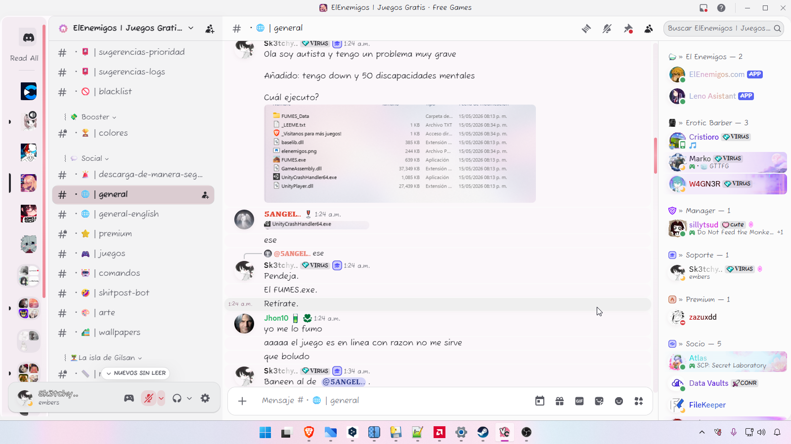
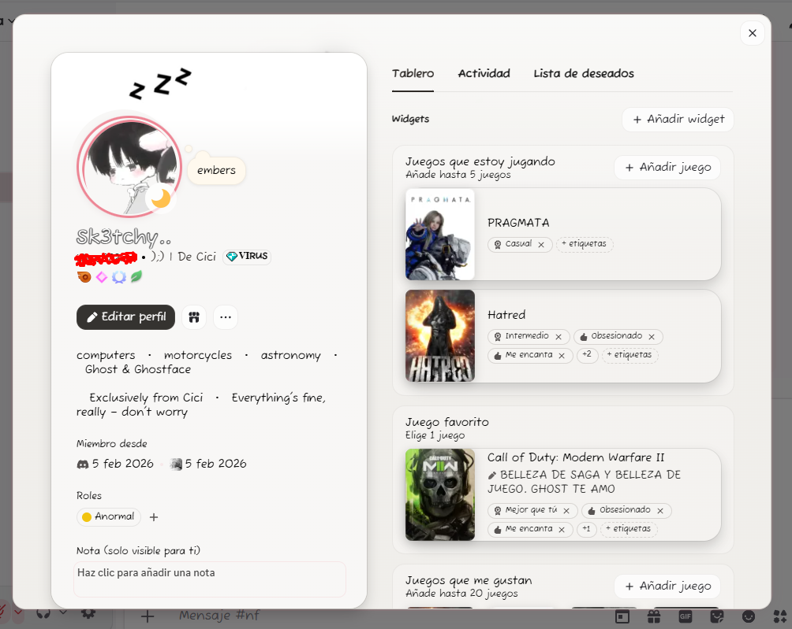
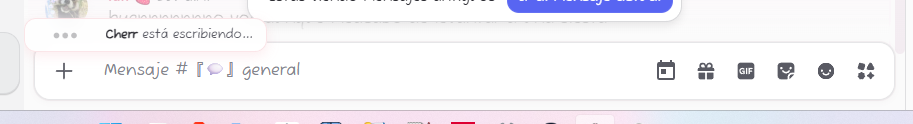

# Sweet-Rose-Dream-Discord
Sweet Rosé Dream (v9.3.7) is the peak evolution of cutecore minimalism for Discord. Created in collaboration with AI engineering models, it was born out of a desire for a clean, warm, highly performant, and accessible interface. It blends advanced glassmorphism styles with pastel tones and user-friendly fonts for a relaxing and seamless visual experience.

## Introduction
Sweet Rosé Dream Ultimate is more than just a fresh coat of paint. It is a complete structural overhaul of the Discord interface (optimized for Vencord, BetterDiscord, and Vesktop) built to eliminate visual clutter and bring a sense of calm to your daily chats.

Embracing the Cutecore aesthetic, this theme pairs soft pastel pinks with crystal-clear glassmorphism, rounded typography, and smooth micro-interactions. Every distracting element from the stock app has been stripped away to give you a clean, seamless, and focused experience.

Development Note: 100% of the CSS architecture, structural debugging, codebase refactoring, and surgical optimizations have been generated and polished by Google Gemini (Advanced/Pro) and DeepSeek V4, working in close collaboration with the repository owner’s creative vision and aesthetic direction.

## Main Features
**Aesthetic Foundation**
* Exclusive Palette: Crisp whites and ultra-soft gray backgrounds (#fdfafd) paired with balanced pastel pink accents (#ed8695). Features a reactive dark mode layout engineered with deep mauve sub-chromatic tones that keep the cutecore essence perfectly intact.
* Charming Typography: Native integration of Google Fonts' 'Fuzzy Bubbles' across the interface for a cozy, handwritten look.
* Smart Readability & WCAG AA Compliance: Hardcoded font exceptions ensure usernames and nicknames stay in gg sans/Helvetica, maintaining absolute legibility without breaking the theme's vibe. Strict contrast rules are applied to all normal, muted, and linked text fields.

**Visual Effects and Glassmorphism**
* Translucent Profiles: User modals, popouts, and profile cards feature blurred, crystal-like backgrounds with finely balanced transparency metrics (`backdrop-filter: blur(12px/14px)`).
* Shadows and Depth: A custom elevation system (var(--shadow-low, medium, high)) makes panels float cleanly over the main background with non-intrusive micro-opacities (0.18 in light mode, 0.25 in dark mode).
* Universal Border Radii: Standardized rounded corners applied globally to panels, avatars, modals, and buttons.

**Functional Optimization (Anti-Bloatware)**
The client interface has been cleaned up at the code level to remove commercial and distracting elements:
* Hidden the Shop button.
* Hidden Nitro Quests.
* Hidden the Nitro Home tab.
* Hidden the Gift Nitro button inside the chat bar.
* Hidden the App Launcher / command shortcut button in the message area.

**Micro-Interactions and Animations**
* Floating Typing Indicator: The "User is typing..." bar is now an elegant translucent glass bubble with increased rounded corners and a rich box-shadow that lifts smoothly above the chat via a custom float-up animation.
* Dynamic Avatars and Buttons: Subtle hover animations scale and rotate action buttons slightly for a more tactile, responsive feel. Message overlays feature smooth box-shadow fades to eliminate screen flickering.
* Cutecore Scrollbars: Redesigned scrollbars featuring smooth pastel pink gradients and fully rounded tracks.

**Pro Modules and Extras**
* Custom Splash Screen: The default loading screen is replaced by an animated "CUTECORE" text element featuring a continuous, shimmering text-shadow sweep effect.
* Pastel Status Indicators: Standard status colors (Online, Idle, DND, Offline) are swapped out for pleasant pastel shades (#a8e6cf for online, #f8bbd0 for Dnd, etc.).

## ⚠️ Known Issues / Under Construction
* **Server Icons Rendering:** There is a known structural bug affecting the correct rendering/styling of certain server icons. This issue is highly complex due to Discord's target classes. It will be prioritized and a fix will be attempted within the week. If a clean native solution is not found, it will remain as-is in the current layout to protect main codebase stability.

## Installation Guide
This theme is compatible with modified Discord clients that support custom CSS injection, such as Vencord, Vesktop, or BetterDiscord.

**Option 1: URL Installation (Recommended for Vencord/Vesktop)**
1. Open User Settings in Discord.
2. Scroll down to the Vencord section and select Themes.
3. Paste the RAW link of this repository into the theme URL field:
`https://raw.githubusercontent.com/Sk3tch1/Sweet-Rose-Dream-Discord/main/sweet-rose-dream.theme.css`
4. Press Enter. The theme will apply instantly.

**Option 2: Manual Installation (BetterDiscord)**
1. Download the `Sweet Rosé Dream.css` file from the Releases section or by cloning this repository.
2. Open Discord and go to User Settings > Themes (under the BetterDiscord section).
3. Click Open Theme Folder.
4. Move the downloaded `.css` file into that folder.
5. Return to Discord and turn on the theme toggle.

## Screenshots
**General Interface:**

**Glassmorphism Profiles:**

**Floating Bar & Details:**

## Credits and Acknowledgments
* **Creative Direction & Vision:** Sk3tch1 - For conceptualizing the Cutecore aesthetic, designing the palette, managing the system layouts, and defining structural workspace declutter targets.
* **Core Development & Engineering:** Google Gemini Advanced (Pro) - Responsible for the foundational architecture, modular code separation, target selector layouts, layout transition timing, and micro-interaction mechanics.
* **Refactoring, Polishing & Advanced Optimization:** DeepSeek V4 - Responsible for the massive v9.3.7 surgical refactoring, `!important` optimization sweep, hardware acceleration path adjustments, and WCAG AA accessibility layering compliance.
* **Typography:** Fuzzy Bubbles hosted via Google Fonts.

## License
Distributed under the MIT License. Feel free to modify, share, and adapt the code for your own personal projects, provided you keep the original credits intact.
